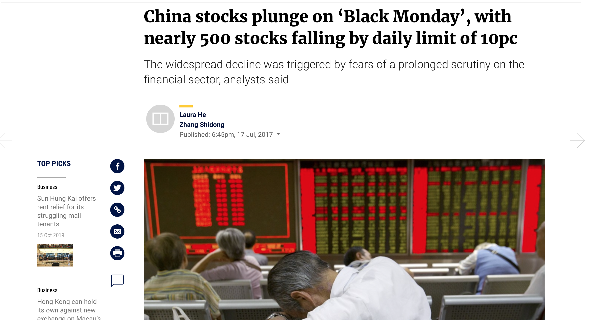
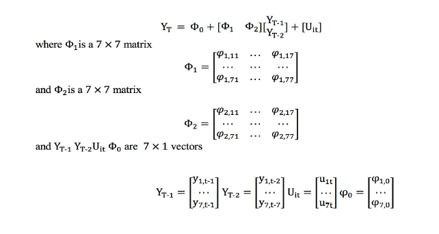
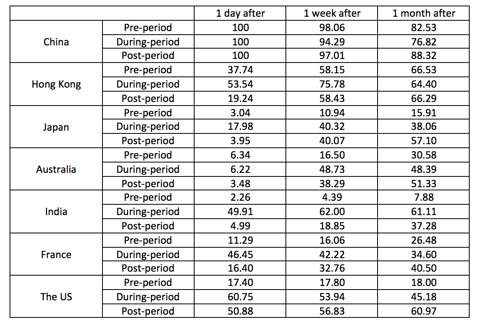
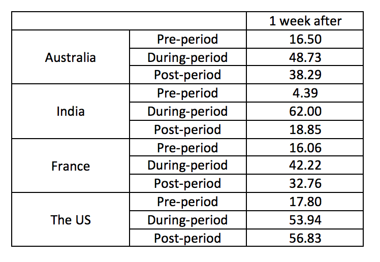
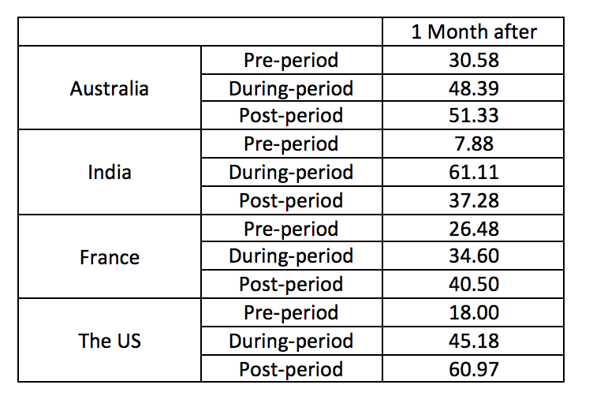

class: center, middle 
```{r setup, include=FALSE}
knitr::opts_chunk$set(echo = FALSE)
library(xaringan)
library(tibble)
library(magrittr)
library(dplyr) 
```

## China's Influence in the Global Financial Market - Volatility Index 

.pull-left[.center[  
]]

.pull-right[
### The research question posed to this end is whether volatility in China has a significant impact on volatility in other markets and whether this impact has been increasing over time. 
]
---
## Contents

### Data
### VAR and Structural VAR
### Granger Causality
### Variance Decompositions 
### Diebold-Yilmaz Spillover Index 
### Conclusion
---
## Data 
.center[]

---
## Data

```{r,cache=TRUE, message=FALSE, warning = FALSE}
library(tidyverse)
library(formattable)
tribble(
  ~ "Stock Market", ~"Volatility Index",
  "China", "ETF VIX",
  "Hong Kong", "HSIVIX",
    "The US", "S&P500 VIX",
  "Japan","Nikkei VIX",
  "Australia","S&P/ASX 200 VIX",
  "France","CAC 40 VIX",
  "India", "India VIX") %>%
  knitr::kable(format = "html") 

```
.left[
There is a nascent body of literature documenting the fact that shocks to the once isolated Chinese stock market are having greater implications for financial markets all over the world.]
---
## Data 

.center[
```{r plot, cache=TRUE, message=FALSE, warning = FALSE,out.width = '700px'}
library(ggplot2)
library(gganimate)
library(tidyr)
library(readxl)
library(gifski)
total<- read_excel("data/total.xlsx")
totallong<- gather(total, country, index,China:India)
totallong$index <- as.numeric(as.character(totallong$index))
g<- ggplot(data=totallong, aes(x = Date, y = index)) + 
  geom_line(aes(color = country))  +
  ylab("index") +
  xlab("Date")  +
  ggtitle("Vix Index Over The Period") +
  geom_vline(xintercept = as.POSIXct("2015-06-01"), linetype=4)+
  geom_vline(xintercept = as.POSIXct("2016-06-01"), linetype=4)+ 
  transition_reveal(Date) 
animate(g, height = 600, width =1000)
```
] 
.left[
- First Period: 1 June 2013 to 29 May 2015
- Second Period: 1 June 2015 to 30 June 2016
- Thrid Period: 1 July 2016 tp 29 June 2018]
---
## VAR and Structural VAR

.center[]


.left[
- The variables used in this VAR are volatility indices for seven different financial markets. A seven-variate VAR is estimated for each period and the lag length is chosen according to the Hannan-Quinn information Criteria.
- In the periods before and after the stock market crash the optimal lag length is 2 and during the crash period, the optimal lag is 1.
]

---
## VAR and Structural VAR

```{r,cache=TRUE, message=FALSE, warning = FALSE}
tribble(
  ~ "Stock Market", ~"Running Hour of the Stock Market in (UTC)",
  "China", "1:30-7:00",
  "Hong Kong", "1:30-8:00",
  "Japan","0:00-6:00",
  "Australia","0:00-6:00",
  "India","3:45-10:00",
  "France", "8:00-16:30",
  "The US", "14:30-21:00"
) %>%
  knitr::kable(format = "html")
```
  
.left[
The Cholesky ordering is based on the open time for the relevant stock markets. Since the influence of the Chinese financial market is being investigated, the Chinese volatility index will be put first.
]
---
## Granger Causality
.pull-left[ 
.left[
- During the post-crash period, the granger causality test tells us that the volatility in none of the stock markets included in the sample are being granger caused by the volatility in the China stock market.
- The individual p-value for the relevant granger causality test indicate that in the during and post-crash periods China’s volatility granger causes the volatility in three of the other stock markets including HK, Japan and India.
]]
.pull-right[ 
```{r,cache=TRUE, message=FALSE, warning = FALSE}
 tribble(
  ~ "Stock Market", ~"Pre",~"During",~"Post",
  "Hong Kong", 0.0006,0.0086,0.029,
  "Japan",0.0604,0.3039,0.0063,
  "Australia",0.0404,0.0271,0.1996,
  "India",0.1974,0.0218,0.0001,
  "France", 0.1220,0.4176, 0.2620,
  "The US", 0.4692,0.9802,0.2276
) %>%
  knitr::kable(format = "html")
```
]
---
## Granger Causality

.pull-left[ 
.left[
- The overall p values for China in these granger causality test lead to the conclusion that it is exogeneous in the last period and endogenous in the first 2 periods.
- This result suggests that China is moving away from being a stock market that it is influenced by volatility in other stock market to one that influences and cause volatility in other financial markets. China does not granger cause France or US in any periods. 
]]

.pull-right[ 
```{r,cache=TRUE, message=FALSE, warning = FALSE}
 tribble(
  ~ "Stock Market", ~"Pre",~"During",~"Post",
  "Hong Kong", 0.0006,0.0086,0.029,
  "Japan",0.0604,0.3039,0.0063,
  "Australia",0.0404,0.0271,0.1996,
  "India",0.1974,0.0218,0.0001,
  "France", 0.1220,0.4176, 0.2620,
  "The US", 0.4692,0.9802,0.2276
) %>%
  knitr::kable(format = "html")
```
]

---
## Variance Decompositions 

.center[]
---
## Variance Decompositions 
### Immediate Effect - After 1 Day

.pull-left[
- For Japan, about 18% variation due to the variation in China’s stock market in during-period, and only 3% in pre-period. 
- For India, France, and The US, there are large increases in their variation that is due to the variation in the Chinese stock market in During-crash period comparing to the pre-crash period. 
]

.pull-right[]
---
## Variance Decompositions 
### Short Term Effect - After 1 Week 
.pull-left[ 
- In general there is a large spike in the percentage variance in forecasted volatility in each stock market that is due to the variance in china’s stock market in the during period. 
- In period after crash, these percentages fall to a level but they still higher than that in the pre-crash period. 
]

.pull-right[]
---
## Variance Decompositions 
### Long Term Effect - After 1 Month 
.pull-left[ 
- For the US market, only 18% of the variation is due to the variation in china’s stock market in pre-crash period.
- The percentage suddenly jump up to 45% in during-crash period. After that, in post-crash period, the percentage even increase to 60%. 
- All of them have shown the evidence of increasing influence of China’s stock market.
]

.pull-right[]
---
## Diebold-Yilmaz Spillover Index 
```{r}
tribble(
  ~ " ", ~"H=1(one day after shock) ", ~"H=5(one week after shock) ", ~"H=25(one month after shock) ",
  "pre-crisis", 0.16691, 0.27544, 0.40123,   
  "during-crisis", 0.40064, 0.58175, 0.67241,
  "post-crisis", 0.19097, 0.43093, 0.56084) %>%
  knitr::kable(format = "html")
```

.left[
- The statistics summary of the spillover indexes calculated is shown in Table 5 for three different forecast horizons of 1, 5 and 25, which correspond to a day, week and month respectively, for the pre-crisis, crisis and post-crisis periods. 
-Firstly, the spillover between markets increases with the forecast horizon increasing. 
-	Secondly, the highest degree of the spillover between the markets is considered during the period covered by China’s stock market crash, by comparing the spillover indexes of the same horizon across pre-crisis, during-crisis and post-crisis periods.
 ]
 
---
## Diebold-Yilmaz Spillover Index 

.left[
- Firstly, there is a large spike in this measure in the period covered by China’s stock market crash. 
- Secondly, the index increases in the post-crash period relative to the pre-crash period. 
- Link: The variations in volatility in each stock market that is due to variations in China’s stock market volatility.
- It provides a suggestive evidence that the increase in the spillover over the same period is driven by China.]
.center[]

---
## Conclusion
.center[
```{r plot2, cache=TRUE, message=FALSE, warning = FALSE,out.width = '700px'}
library(ggplot2)
library(gganimate)
library(tidyr)
library(readxl)
library(gifski)
total<- read_excel("data/total.xlsx")
totallong<- gather(total, country, index,China:India)
totallong$index <- as.numeric(as.character(totallong$index))
g<- ggplot(data=totallong, aes(x = Date, y = index)) + 
  geom_line(aes(color = country))  +
  ylab("index") +
  xlab("Date")  +
  ggtitle("Vix Index Over The Period") +
  geom_vline(xintercept = as.POSIXct("2015-06-01"), linetype=4)+
  geom_vline(xintercept = as.POSIXct("2016-06-01"), linetype=4)+ 
  transition_reveal(Date) 
animate(g, height = 600, width =1000)
```
]
---
## Conclusion
.center[]

---
class: center, middle 

.center[]


---
class: center, middle 
background-image:url(chilli.jpg)
background-position: center;
background-repeat: no-repeat;
background-size: contain;  
# Thank You 
